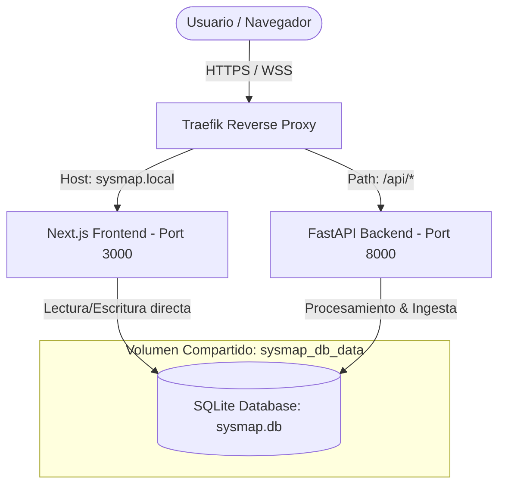

🌍 [Read in English](README.md)

# Sysmap — Radar de Eventos Tech (Buenos Aires)


**Sysmap** es la plataforma Open-Core desarrollada por **TecnoAncon** para indexar, normalizar y distribuir eventos, meetups, conferencias y workshops tecnológicos de manera sostenible y regionalizada en Buenos Aires, Argentina.

Diseñado bajo la filosofía **Solarpunk** (tecnología descentralizada, local-first y adaptada a la comunidad) y una arquitectura **Mobile-First** estricta (optimizada primariamente para 360x800px).

---

## 🏗️ Arquitectura del Sistema

El ecosistema de Sysmap se compone de tres elementos principales orquestados mediante contenedores aislados que comparten una base de datos local SQLite (`sysmap.db`).



### Componentes

1. **Frontend (Next.js 16 + React 19):**
   * Interface de usuario premium, estilizada con **Tailwind CSS 4** y CSS tokens HSL optimizados para modo oscuro.
   * Adaptadores de bases de datos modernos con **Prisma 7**.
   * Gestión de autenticación segura vía **NextAuth.js** (OAuth de Google).
   * Alertas en tiempo real por correo electrónico y notificaciones inteligentes.

2. **Backend (Python 3.10+ + FastAPI):**
   * Pipeline de ingesta de datos asíncrono para raspar eventos de múltiples fuentes (Luma, Meetup, Eventbrite).
   * Clasificador de eventos impulsado por Inteligencia Artificial (API de Google Gemini) con filtrado semántico y capa de caché preventiva (`cache_ia`) para optimizar el consumo de tokens.
   * Distribuidor de boletines automatizado vía Resend.

3. **Base de Datos (SQLite + Volumen Compartido):**
   * Persistencia en un archivo local unificado de SQLite que simplifica la portabilidad y cumple con el principio de aislamiento Multi-Tenant de TecnoAncon.

---

## 🛠️ Estructura del Repositorio

```text
sysmap-app/
├── docker-compose.yml           # Orquestación de producción/staging con Traefik
├── .env.example                 # Plantilla de variables globales de entorno
├── README.md                    # Guía principal de ingeniería
└── codigo_fuente/
    ├── backend/                 # FastAPI service
    │   ├── app/                 # Lógica de negocio (scrapers, pipeline, db, config)
    │   ├── tests/               # Pruebas unitarias
    │   ├── Dockerfile
    │   └── requirements.txt
    └── frontend/                # Next.js service
        ├── src/                 # Código fuente React (pages, API routes, components)
        ├── prisma/              # Esquema de datos y migraciones de Prisma
        ├── Dockerfile
        └── package.json
```

---

## ⚙️ Configuración del Entorno

Para levantar Sysmap de forma local, crea un archivo `.env` en la raíz del proyecto (basándote en `.env.example`) y configura las siguientes variables clave:

```env
# Dominio de acceso del sistema
SYSMAP_HOST=sysmap.local

# Claves de Ingestión & IA (Backend)
GEMINI_API_KEY=tu_gemini_api_key
RESEND_API_KEY=tu_resend_api_key
EVENTBRITE_API_KEY=tu_eventbrite_token

# Claves de Autenticación & NextAuth (Frontend)
NEXTAUTH_SECRET=tu_nextauth_secret_generado
AUTH_GOOGLE_ID=tu_google_oauth_client_id
AUTH_GOOGLE_SECRET=tu_google_oauth_client_secret
```

---

## 🚀 Despliegue e Instrucciones de Ejecución

### Opción A: Despliegue con Docker Compose (Recomendado para Producción)

El entorno utiliza Traefik como proxy inverso en una red externa llamada `tecnoancon-proxy`.

1. **Crear la red de Traefik si no existe:**
   ```bash
   docker network create tecnoancon-proxy
   ```

2. **Levantar los servicios:**
   ```bash
   docker-compose up --build -d
   ```

3. **Verificar estado:**
   ```bash
   docker-compose ps
   ```

---

### Opción B: Ejecución en Modo Desarrollo (Local)

#### 1. Iniciar el Backend (Python/FastAPI)

1. Ve a la carpeta del backend y crea un entorno virtual:
   ```bash
   cd codigo_fuente/backend
   python -m venv .venv
   source .venv/bin/activate  # En Windows: .venv\Scripts\activate
   ```
2. Instala las dependencias y crea las variables de entorno locales:
   ```bash
   pip install -r requirements.txt
   cp .env.example .env
   ```
3. Ejecuta el servidor uvicorn:
   ```bash
   uvicorn app.main:app --reload --port 8000
   ```

#### 2. Iniciar el Frontend (Next.js)

1. Ve a la carpeta del frontend:
   ```bash
   cd codigo_fuente/frontend
   npm install
   ```
2. Sincroniza la base de datos de SQLite mediante Prisma:
   ```bash
   npx prisma db push
   ```
3. Levanta el servidor de desarrollo de Next.js:
   ```bash
   npm run dev
   ```
4. Abre `http://localhost:3000` en tu navegador.

---

## 🧪 Pruebas Unitarias e Integración

### Backend
Para ejecutar los tests de Python:
```bash
cd codigo_fuente/backend
pytest
```

### Frontend
Para realizar la compilación estática e inspección de TypeScript del sitio:
```bash
cd codigo_fuente/frontend
npm run build
```

---

## 🛡️ Estándares de Seguridad y Open-Core

En concordancia con la **Constitución Global de la Software Factory**:
* **Aislamiento Multi-Tenant:** La base de datos es local y autocontenida por cliente. No se comparten esquemas de bases de datos entre instancias de clientes corporativos.
* **Token-Economy:** Toda ingesta y procesamiento semántico por Inteligencia Artificial pasa por `cache_ia`. Si el hash del evento coincide, el veredicto se recupera a costo cero evitando llamadas redundantes a la API de Gemini.
* **Variables Protegidas:** Bajo ninguna circunstancia se deben subir API keys ni credenciales en código abierto (`.gitignore` sanitizado).
