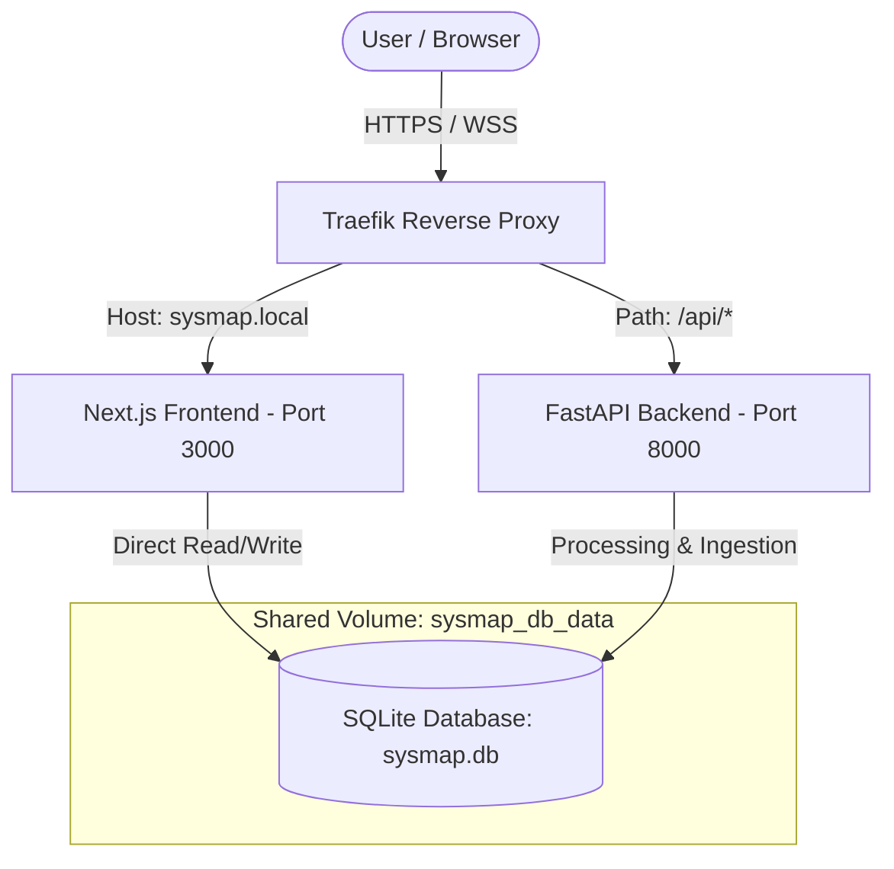

🌍 [Leer en Español](README.es.md)

# Sysmap: AI-Powered Market Intelligence & Event Radar

**Sysmap** is an enterprise-grade, Open-Core market intelligence platform developed by **TecnoAncon**. It is designed to ingest, normalize, and distribute tech events, meetups, conferences, and workshops in a highly efficient, regionalized manner.

Built with a **Solarpunk** philosophy (decentralized, community-focused, local-first technology) and an absolute **Mobile-First** architecture (optimized primarily for a 360x800px viewport).

---

## 💼 Business Use Case

In modern corporate environments, staying ahead of ecosystem shifts, competitive movements, and talent concentration is critical. Sysmap solves this by transforming unstructured public event data into high-value market intelligence:

*   **Automated Discovery:** Sysmap continually monitors, ingests, and structures events from multiple hosting platforms without requiring manual human labor.
*   **Noise Reduction:** By combining local heuristics with advanced LLM classifiers, the system filters out more than 90% of irrelevant clutter, ensuring strategic decision-makers only see meaningful signals.
*   **Actionable Strategy & PMO Insights:**
    *   **Strategy & B2B Sales:** Detect emerging themes (e.g., AI Agents, Web3, Cloud orchestration) to align market positioning and identify new accounts.
    *   **HR & Talent Acquisition:** Map local technology hubs and active community events to locate engineering talent pools.
    *   **PMO (Project Management Office):** Coordinate corporate attendance, optimize sponsorship budgets, and adapt product roadmaps based on industry trends.

---

## 🏗️ System Architecture

The Sysmap ecosystem runs on isolated tenant containers sharing a persistent local SQLite database (`sysmap.db`).



### Components

1.  **Frontend (Next.js 16 + React 19):**
    *   Premium user interface optimized for mobile viewports (360x800px) with custom HSL dark-mode CSS tokens.
    *   State-of-the-art database interaction using **Prisma 7**.
    *   Secure authentication using **NextAuth.js** (Google OAuth).
    *   Real-time email alerts and notification workflows.

2.  **Backend (Python 3.12+ + FastAPI):**
    *   Asynchronous data ingestion pipeline to scrape events from Luma, Meetup, and Eventbrite.
    *   AI-powered event classifier utilizing Gemini APIs with caching to manage the token budget.
    *   Automated newsletters sent via Resend API.

3.  **Database (SQLite + Shared Volume):**
    *   A portable, isolated SQLite database file per tenant, upholding TecnoAncon's strict Multi-Tenant security and data sovereignty policies.

---

## 🧠 AI Architecture & Token Economy

Behind the scenes, Sysmap orchestrates LLMs in accordance with our strict cost-optimization and privacy principles:

### 1. Ingestion Pipeline & Orchestration
*   **Sequence:** The ingestion runner (`run_all_scrapers`) sequentially calls: Luma scraper $\rightarrow$ Meetup scraper $\rightarrow$ Eventbrite scraper.
*   **Rate-Limiting:** A delay of `SCRAPER_REQUEST_DELAY_SECONDS = 2` is enforced between HTTP requests to respect external servers and prevent IP blocks.
*   **Extraction Methods:** The Meetup parser targets `application/ld+json` HTML blocks; Luma targets the Next.js `__NEXT_DATA__` JSON payload; Eventbrite leverages both native JSON-LD and the official REST API.

### 2. Preventive Caching Layer (`cache_ia`)
To ensure a sustainable **Token-Economy**, Sysmap avoids contacting the LLM for duplicate or redundant events:
*   Before calling the Gemini API, a deterministic MD5 hash is calculated from the event's raw text (`title` + `description`).
*   The system checks the database table `cache_ia`. If the hash exists, the classification is resolved instantly at **zero marginal cost**.
*   **Local Heuristics (Cost-0 pre-filter):** Simple regex rules scan for clear-cut non-tech or tech keywords (using word boundaries `\bword\b`) before checking the cache, bypassing the LLM entirely for obvious matches.

### 3. Context Injection (Static Skills)
*   The system prompt directives are decoupled from application logic and stored in [classification_skill.md](file:///home/thonii/proyectos/sysmap-app/codigo_fuente/backend/app/skills/classification_skill.md).
*   **Pure Knowledge Injection:** This skill file is a static Markdown file read by the backend at runtime. We explicitly avoid experimental, network-dependent Model Context Protocol (MCP) servers to guarantee execution speed and offline resilience.
*   **Structured Output:** The LLM runs in strict JSON mode (`response_mime_type: "application/json"`) utilizing `gemini-2.5-flash` with a cascading fallback to `gemini-1.5-flash`.

### 4. Failure Modes & Mitigation Strategy
*   **Scraper Structural Breaks:** If Luma, Meetup, or Eventbrite change their web layouts, the individual scrapers catch exceptions gracefully. The pipeline proceeds to other platforms uninterrupted, and fails over to secondary CSS selector patterns.
*   **Hallucination Prevention:** The LLM is only utilized for semantic verification and tag categorization. Vital structured data (dates, URLs, coordinates) is extracted directly from the source code/API responses, preventing the model from hallucinating critical scheduling details.
*   **API Outages & Timeouts:** We implement strict timeouts (15s for scrapers, 20s for APIs). If the Gemini API returns a rate-limit (HTTP 429) or network timeout, the backend falls back to `gemini-1.5-flash`. If both models fail, the system falls back to marking the event as non-tech for manual admin review.

---

## 🛠️ Repository Structure

```text
sysmap-app/
├── docker-compose.yml           # Production/staging orchestration with Traefik
├── .env.example                 # Global environment variables template
├── README.md                    # Main English engineering guide
├── README.es.md                 # Spanish engineering guide (reference)
└── codigo_fuente/
    ├── backend/                 # FastAPI service
    │   ├── app/                 # Business logic (scrapers, pipeline, DB, config)
    │   ├── tests/               # Backend unit tests
    │   ├── Dockerfile
    │   └── requirements.txt
    └── frontend/                # Next.js service
        ├── src/                 # React source code (pages, components, API routes)
        ├── prisma/              # Prisma schema and migrations
        ├── Dockerfile
        └── package.json
```

---

## ⚙️ Environment Configuration

To set up Sysmap locally, create a `.env` file at the root of the project (copying `.env.example`) and configure the variables below:

```env
# Ingress host domain
SYSMAP_HOST=sysmap.local

# Ingestion & AI Keys (Backend)
GEMINI_API_KEY=your_gemini_api_key
RESEND_API_KEY=your_resend_api_key
EVENTBRITE_API_KEY=your_eventbrite_token

# Authentication & NextAuth Keys (Frontend)
NEXTAUTH_SECRET=your_generated_nextauth_secret
AUTH_GOOGLE_ID=your_google_oauth_client_id
AUTH_GOOGLE_SECRET=your_google_oauth_client_secret
```

---

## 🚀 Deployment & Execution Instructions

### Option A: Deployment with Docker Compose (Recommended for Production)

The stack uses Traefik as a reverse proxy routed through an external network called `tecnoancon-proxy`.

1.  **Create the Traefik network if it does not exist:**
    ```bash
    docker network create tecnoancon-proxy
    ```

2.  **Spin up the containers:**
    ```bash
    docker-compose up --build -d
    ```

3.  **Verify container health:**
    ```bash
    docker-compose ps
    ```

---

### Option B: Local Development Execution

#### 1. Ingest & Classification Backend (Python/FastAPI)

1.  Navigate to the backend folder and create a virtual environment:
    ```bash
    cd codigo_fuente/backend
    python -m venv .venv
    source .venv/bin/activate  # On Windows: .venv\Scripts\activate
    ```
2.  Install dependencies and copy environment variables:
    ```bash
    pip install -r requirements.txt
    cp .env.example .env
    ```
3.  Run the Uvicorn live server:
    ```bash
    uvicorn app.main:app --reload --port 8000
    ```

#### 2. User Interface Frontend (Next.js)

1.  Navigate to the frontend folder:
    ```bash
    cd codigo_fuente/frontend
    npm install
    ```
2.  Sync the SQLite database schema via Prisma:
    ```bash
    npx prisma db push
    ```
3.  Start the Next.js development server:
    ```bash
    npm run dev
    ```
4.  Open `http://localhost:3000` in your web browser.

---

## 🧪 Unit & Integration Testing

### Backend Testing
To run Python tests:
```bash
cd codigo_fuente/backend
pytest
```

### Frontend Typechecking & Building
To run a static build and perform TypeScript validation:
```bash
cd codigo_fuente/frontend
npm run build
```

---

## 🛡️ Security & Open-Core Standards

Consistent with the **TecnoAncon Global Software Factory Constitution**:
*   **Data Sovereignty & Multi-Tenancy:** Each deployment uses a local, self-contained SQLite file. Databases are never merged or co-located across different corporate instances.
*   **Token-Economy Caching:** Any event processed by AI has its MD5 hash saved to `cache_ia`. Future runs resolve duplicate hits locally, preserving resource limits and avoiding API bills.
*   **Secret Sanitation:** API keys, OAuth credentials, and local secrets must never be committed to open repositories (`.gitignore` must be strictly maintained).
